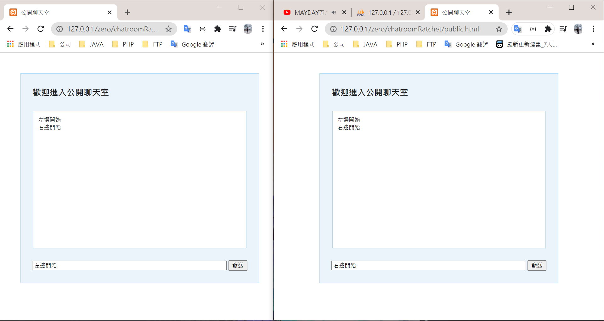
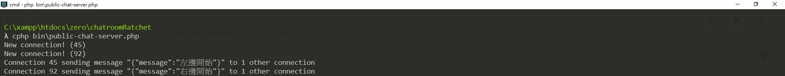

## PHP Ratchet Web Socket

  1. composer update 更新
  2. cmd send php bin\public-chat-server.php 執行命令
  3. Turn on local service 開啟本地服務器
  4. Open two browsers and execute public.html 打開兩個瀏覽器並執行public.html

  

  